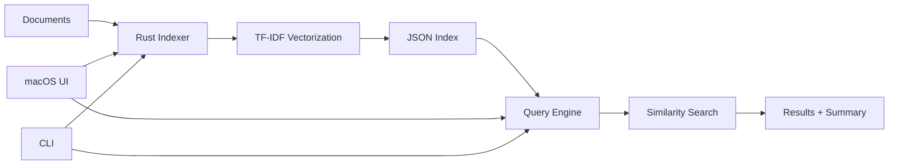

# ⚡️🤖 VoltAI — Fast Local-First AI Agent

**Status**: Fast, privacy-first local document search and summarization. Rust CLI + macOS SwiftUI. Requires Ollama for LLM generation.

<div align="center">


[](https://opensource.org/licenses/MIT)

**Lightning-fast, privacy-first AI assistant for secure, offline document search and summarization**

[Features](#features) • [Demo](#demo) • [Installation](#installation) • [Usage](#usage) • [Architecture](#project-architecture) • [Contributing](#contributing)

</div>

<a id="demo"></a>
## 🎥 Demo


**Try it yourself:**
1. Drag a folder of documents into the macOS UI
2. VoltAI indexes files and creates `voltai_index.json`
3. Ask natural language questions in the chat interface
4. Get instant answers with source citations
---

<a id="table-of-contents"></a>
## 📋 Table of Contents

- [Demo](#demo)
- [What is VoltAI?](#what-is-voltai)
- [Why VoltAI?](#why-voltai)
- [Features](#features)
- [How It Works](#how-it-works)
- [Installation](#installation)
  - [Prerequisites](#prerequisites)
  - [Building from Source](#building-from-source)
- [Usage](#usage)
  - [CLI Usage](#cli-usage)
  - [macOS UI Usage](#macos-ui-usage)
- [Project Architecture](#project-architecture)
- [Configuration](#configuration)
- [Supported File Formats](#supported-file-formats)
- [Design Decisions & Trade-offs](#design-decisions--trade-offs)
- [Roadmap](#roadmap)
- [Troubleshooting](#troubleshooting)
- [Contributing](#contributing)
- [License](#license)
- [Acknowledgments](#acknowledgments)
- [Contact](#contact)
- [Star History](#star-history)

---
<a id="what-is-voltai"></a>
## 🤔 What is VoltAI?

VoltAI is a compact, **local-first AI agent** implemented in Rust with a companion macOS SwiftUI front-end. It demonstrates a practical, privacy-respecting information retrieval and local-LLM orchestration workflow suitable for:

- 👨‍💻 Developer tooling and documentation indexing
- 🔬 Research workflows and paper management
- 📚 Offline knowledge base creation
- 🔐 Private document analysis (data never leaves your machine)

Unlike cloud-based AI tools, VoltAI keeps your data on your machine, making it ideal for sensitive documents, proprietary code, and private datasets.

---
<a id="why-voltai"></a>
## 🎯 Why VoltAI?

### 🔐 Privacy-First
- **Zero cloud uploads**: All data processing happens locally
- **No external API calls**: Your documents never leave your machine
- **Audit-friendly**: Perfect for compliance-sensitive environments

### ⚡ Fast & Lightweight
- **TF-IDF indexing**: Blazing-fast similarity search
- **Parallel processing**: Multi-threaded indexing with Rayon
- **Minimal resource usage**: Efficient memory footprint

### 🔧 Extensible Architecture
- **Modular design**: Easy to swap TF-IDF for embeddings
- **LLM-ready**: Clear integration points for Ollama, llama.cpp
- **Vector DB compatible**: Can be extended to use Qdrant or similar

### 🎨 User-Friendly
- **Drag-and-drop UI**: macOS native SwiftUI interface
- **CLI available**: Scriptable automation workflows
- **Chat-style interface**: Natural query experience

---
<a id="features"></a>
## ✨ Features

### Core Functionality
- 📂 **Recursive Directory Indexing**: Automatically walk through nested folders
- 📄 **Multi-Format Support**: Index `.txt`, `.md`, `.csv`, `.json`, `.pdf` files
- 🔍 **Fast Similarity Search**: TF-IDF-based document retrieval
- 💬 **Query Interface**: Both CLI and GUI query modes
- 📊 **Document Previews**: See relevant excerpts before diving in
- 🛡️ **Safety Measures**: Prevents accidental dumping of full documents

### Technical Features
- ⚙️ **Parallel Indexing**: Multi-core utilization via Rayon
- 🗜️ **Compact JSON Index**: Efficient serialization format
- 📝 **Debug Logging**: Prompt logging for tuning and reproducibility
- 🔄 **Extensibility Points**: Ready for embeddings and vector stores

---
<a id="how-it-works"></a>
## 🔧 How It Works


```mermaid
graph LR
    A[Documents] --> B[Rust Indexer]
    B --> C[TF-IDF Vectorization]
    C --> D[JSON Index]
    D --> E[Query Engine]
    E --> F[Similarity Search]
    F --> G[Results + Summary]
    
    H[macOS UI] --> B
    H --> E
    I[CLI] --> B
    I --> E
```

### Indexing Pipeline
1. **File Discovery**: Recursively walks directories, identifies supported formats
2. **Text Extraction**: Extracts plain text (with PDF support via `lopdf` or similar)
3. **TF-IDF Computation**: Calculates term frequency-inverse document frequency vectors
4. **Index Creation**: Serializes vectors and metadata to `voltai_index.json`

### Query Pipeline
1. **Query Vectorization**: Converts user query to TF-IDF vector
2. **Similarity Calculation**: Computes cosine similarity against indexed documents
3. **Top-K Retrieval**: Returns most relevant documents
4. **Summary Generation**: (Optional) Provides AI-generated summary using LLM

---
<a id="installation"></a>
## 💻 Installation
<a id="prerequisites"></a>
### Prerequisites
<a id="prerequisites"></a>
#### Required
- **Rust**: 1.70.0 or later ([install via rustup](https://rustup.rs/))
- **macOS**: For the SwiftUI front-end (CLI works on any platform)
- **Xcode Command Line Tools**: `xcode-select --install`

#### Optional
- **Xcode**: For GUI development and debugging
- **Ollama or llama.cpp**: For local LLM integration (future feature)

### Building from Source

```bash
# Clone the repository
git clone https://github.com/wesleyscholl/VoltAI.git
cd VoltAI

# Build the Rust CLI (release mode for optimal performance)
cargo build --release

# The binary will be at: target/release/voltai
```

#### Building the macOS UI

```bash
# Navigate to the macOS UI directory
cd mac-ui

# Option 1: Run with Swift CLI
swift run

# Option 2: Open in Xcode
open VoltAI.xcodeproj  # or open the workspace if using SPM
# Then build and run (⌘R)
```

### Verifying Installation

```bash
# Check the CLI is working
./target/release/voltai --help

# Should output:
# VoltAI - Local AI Agent
# 
# USAGE:
#     voltai <SUBCOMMAND>
# 
# SUBCOMMANDS:
#     index    Index a directory of documents
#     query    Query an existing index
#     help     Print this message
```

---
<a id="usage"></a>
## 📖 Usage
<a id="cli-usage"></a>
### CLI Usage

#### Indexing Documents

```bash
# Basic indexing
./target/release/voltai index \
  --directory /path/to/documents \
  --output voltai_index.json

# Short flags
./target/release/voltai index \
  -d /path/to/documents \
  -o my_index.json
```

**Options:**
- `-d, --directory <PATH>`: Directory to index (required)
- `-o, --output <FILE>`: Output index file (default: `voltai_index.json`)

#### Querying the Index

```bash
# Basic query
./target/release/voltai query \
  --index voltai_index.json \
  --query "summarize the architecture documentation" \
  --top-k 5
```

**Options:**
- `-i, --index <FILE>`: Index file to query (required)
- `-q, --query <TEXT>`: Query text (required)
- `-k, --top-k <NUM>`: Number of top documents to include in context (default: 5)
- `-m, --model <MODEL>`: Ollama model to use (e.g., `llama3`, `mistral`)

#### Benchmarking

```bash
./target/release/voltai bench --docs 1000 --queries 50
```

**Options:**
- `-d, --docs <N>`: Number of synthetic documents to generate and index (default: 1000)
- `-q, --queries <N>`: Number of query iterations to average (default: 20)

Generates synthetic documents, indexes them, and measures query latency on your machine. Reports throughput, index size, vocabulary size, and query timing percentiles.

#### Example Output

```
Top 3 results for: "architecture decisions"

1. docs/architecture.md (score: 0.87)
   Excerpt: "VoltAI is designed to be local-first, with extensibility
   as a core principle. The indexer uses TF-IDF for speed..."
   
2. docs/design-notes.pdf (score: 0.72)
   Excerpt: "Local LLM integration enables offline summarization.
   The system prioritizes privacy by avoiding cloud uploads..."
   
3. README.md (score: 0.65)
   Excerpt: "Design decisions & trade-offs: TF-IDF first - fast to
   compute, explainable, and sufficient for small corpora..."

AI Summary:
VoltAI demonstrates a privacy-first local retrieval pipeline that indexes
developer documentation and supports fast summarization. It uses TF-IDF for
initial vectorization and provides clear extension points for embeddings.
```
<a id="macos-ui-usage"></a>
### macOS UI Usage

#### Getting Started

1. **Launch the app**:
   ```bash
   cd mac-ui
   swift run
   # or open in Xcode and run
   ```

2. **Index documents**:
   - Drag a folder into the app window
   - Or click "Select Folder" to browse
   - Wait for indexing to complete (progress bar shows status)

3. **Query your documents**:
   - Type your question in the chat input
   - Press Enter or click Send
   - View results with relevant excerpts

#### UI Features

- **Drag & Drop**: Quickly index new folders
- **Chat Interface**: Natural conversation-style queries
- **Document Preview**: Click results to see full context
- **Index Management**: Save/load different indexes
- **Settings**: Configure top-k results, excerpt length, etc.

#### Keyboard Shortcuts

- `⌘O`: Open index file
- `⌘S`: Save current index
- `⌘R`: Reindex current folder
- `⌘,`: Open preferences
- `⌘Q`: Quit

---
<a id="project-architecture"></a>
## 🏗️ Project Architecture

```
VoltAI/
├── mac-ui/                     # macOS SwiftUI app
│   ├── VoltAI.app/Contents/    # Built app bundle (generated after build)
│   ├── Resources/              # App icons and images
│   │   ├── AppIcon.icns
│   │   └── AppIcon.png
│   ├── scripts/                # Build & packaging scripts
│   │   └── package_and_open.sh
│   ├── Sources/VoltAI/         # SwiftUI source files
│   │   ├── VoltAICaller.swift  # Handles API calls and backend communication
│   │   ├── VoltAIViewModel.swift # ViewModel (MVVM) for app logic
│   │   ├── ContentView.swift   # Main SwiftUI content view
│   │   ├── DropZone.swift      # Drag-and-drop UI logic
│   │   └── main.swift          # macOS app entry point
│   ├── Package.swift           # Swift package configuration
│   └── Makefile                # macOS build automation
│
├── src/                        # Rust CLI source
│   └── main.rs                 # CLI entry point
│
├── docs/                       # Project documentation
│   ├── a.txt
│   └── b.txt
│
├── test_docs/                  # Example and test input files
│   ├── ai.txt
│   └── nlp.txt
│
├── tools/                      # Utility scripts and generators
│   └── render_logo.swift
│
├── Cargo.toml                  # Rust dependencies
├── Cargo.lock                  # Cargo lockfile
├── LICENSE                     # MIT license
├── Makefile                    # Build helpers
├── voltai_index.json           # Index file (generated or static)
└── README.md                   # Project documentation (this file)
```

### Key Components

#### Rust CLI (`src/`)

The entire Rust implementation lives in `src/main.rs`, which contains:

- **File walking**: Recursively discovers `.txt`, `.md`, `.csv`, `.json`, `.pdf` files
- **Text extraction**: Reads plain text and extracts text from PDFs via `pdf-extract`
- **TF-IDF indexing**: Computes log-TF × IDF vectors with L2 normalization using parallel processing
- **Search**: Dot product against pre-normalized document vectors (equivalent to cosine similarity)
- **Summarization**: Routes top-k context to an Ollama model for LLM generation; falls back to keyword extraction if Ollama is unavailable

**Design Principles**:
- Single-binary deployment — no Python, no separate server
- Parallel processing with `rayon` for indexing performance
- Zero network calls during indexing or search

#### macOS UI (`mac-ui/`)

**Architecture**: MVVM (Model-View-ViewModel)

- **Views**: SwiftUI components for UI rendering
- **ViewModels**: Business logic and state management
- **Models**: Data structures (Index, Document, Query)
- **Services**: CLI orchestration, file handling

**Key Features**:
- Native macOS experience
- Background indexing (doesn't block UI)
- Capped JSON preview loading (prevents main thread blocking)
- Drag-and-drop support

---
<a id="configuration"></a>
## ⚙️ Configuration

### CLI Configuration

Create a `voltai.toml` in your home directory or project root:

```toml
[indexing]
max_file_size = "10MB"
exclude_patterns = ["*.tmp", "*.log", "node_modules/**"]
pdf_extraction = true
parallel_threads = 0  # 0 = auto-detect CPU cores

[query]
default_top_k = 5
show_scores = false
excerpt_length = 200  # characters

[llm]
enabled = false
provider = "ollama"  # or "llamacpp"
model = "llama2"
api_url = "http://localhost:11434"
```

### Environment Variables

```bash
# Set default index location
export VOLTAI_INDEX_PATH="$HOME/.voltai/default_index.json"

# Enable debug logging
export VOLTAI_LOG_LEVEL="debug"

# Set custom config file
export VOLTAI_CONFIG="$HOME/.config/voltai/config.toml"
```

---
<a id="supported-file-formats"></a>
## 📄 Supported File Formats

| Format | Extension | Extraction Method | Notes |
|--------|-----------|-------------------|-------|
| Plain Text | `.txt` | Direct read | UTF-8 encoding expected |
| Markdown | `.md` | Direct read | Preserves structure |
| JSON | `.json` | Parsed + flattened | Extracts text values |
| CSV | `.csv` | Column concatenation | Headers preserved |
| PDF | `.pdf` | Text extraction | Via `lopdf` or `pdfium` |

### Adding New Formats

To add support for a new format:

1. Implement extraction logic in `src/indexer/text_extractor.rs`
2. Add file type detection in `src/utils/file_types.rs`
3. Update this README with the new format

---
<a id="design-decisions--trade-offs"></a>
## 🎯 Design Decisions & Trade-offs

### TF-IDF vs. Embeddings

**Current: TF-IDF**
- ✅ Fast to compute (milliseconds for small corpora)
- ✅ Explainable results
- ✅ No external dependencies
- ✅ Works offline
- ❌ Limited semantic understanding
- ❌ Struggles with synonyms

**Future: Dense Embeddings**
- ✅ Better semantic search
- ✅ Understands context
- ❌ Slower computation
- ❌ Requires more resources
- ❌ Less explainable

**Decision**: Start with TF-IDF for simplicity and speed. Clear migration path to embeddings exists.

### Local-First Architecture

**Advantages**:
- Complete data privacy
- No API costs
- Works offline
- Low latency

**Disadvantages**:
- Requires local compute resources
- Limited by local hardware
- No cross-device sync (by design)

### Safety Measures

The project includes safeguards to prevent:
- Printing full raw documents in UI
- Dumping entire documents in prompts
- Exposing sensitive data in logs

All prompts are logged to a local debug file for tuning.

---
<a id="roadmap"></a>
## 🗺️ Roadmap

### Short Term (Q1 2025)
- [ ] Add embeddings pipeline (Ollama/llama.cpp integration)
- [ ] Implement two-stage summarization
- [ ] Add document deduplication
- [ ] Improve PDF extraction quality
- [ ] Add unit tests and integration tests

### Medium Term (Q2-Q3 2025)
- [ ] SQLite or Qdrant vector store backend
- [ ] Homebrew formula for easy installation
- [ ] Windows and Linux UI support
- [ ] API server mode for other clients
- [ ] Document clustering and categorization

### Long Term (Q4 2025+)
- [ ] Bundle lightweight offline LLM
- [ ] Fine-grained privacy controls
- [ ] Team/multi-user support
- [ ] Plugin system for custom extractors
- [ ] Knowledge graph visualization

### Community Requests
- See [GitHub Issues](https://github.com/wesleyscholl/VoltAI/issues) for feature requests

---
<a id="troubleshooting"></a>
## 🐛 Troubleshooting

### Common Issues

#### Build Errors

**Problem**: `cargo build` fails with linker errors

**Solution**:
```bash
# macOS: Install Xcode command line tools
xcode-select --install

# Linux: Install build essentials
sudo apt-get install build-essential pkg-config libssl-dev
```

#### PDF Extraction Fails

**Problem**: PDFs index but content is empty

**Solution**:
- Check if PDF is text-based (not scanned image)
- Try updating dependencies: `cargo update`
- File an issue with the problematic PDF (if not sensitive)

#### macOS UI Won't Launch

**Problem**: UI crashes on startup

**Solution**:
```bash
# Rebuild with verbose output
cd mac-ui
swift build -v

# Check for missing Swift dependencies
swift package resolve
```

#### Slow Indexing

**Problem**: Indexing takes too long

**Solutions**:
- Reduce `parallel_threads` in config (might be over-subscribing)
- Exclude large binary files: `--exclude-pattern "*.bin"`
- Use SSD instead of HDD for index storage
- Check for very large files slowing down extraction

### Getting Help

1. Check [GitHub Issues](https://github.com/wesleyscholl/VoltAI/issues)
2. Read the [Discussions](https://github.com/wesleyscholl/VoltAI/discussions)
3. File a new issue with:
   - OS version
   - Rust version (`rustc --version`)
   - Full error message
   - Steps to reproduce

---
<a id="contributing"></a>
## 🤝 Contributing

Contributions are welcome! Whether it's bug fixes, new features, documentation improvements, or examples.

### Getting Started

1. **Fork the repository**
   ```bash
   # Click "Fork" on GitHub, then:
   git clone https://github.com/YOUR_USERNAME/VoltAI.git
   cd VoltAI
   ```

2. **Create a branch**
   ```bash
   git checkout -b feature/your-feature-name
   # or
   git checkout -b fix/bug-description
   ```

3. **Make your changes**
   - Write tests if applicable
   - Follow Rust style guidelines (`cargo fmt`)
   - Run linter (`cargo clippy`)
   - Update documentation

4. **Test your changes**
   ```bash
   # Run tests
   cargo test
   
   # Build in release mode
   cargo build --release
   
   # Try your changes
   ./target/release/voltai --help
   ```

5. **Commit and push**
   ```bash
   git add .
   git commit -m "feat: add amazing feature"
   # Follow conventional commits: feat, fix, docs, style, refactor, test, chore
   
   git push origin feature/your-feature-name
   ```

6. **Open a Pull Request**
   - Go to your fork on GitHub
   - Click "Pull Request"
   - Describe your changes
   - Link any related issues

### Contribution Guidelines

#### Code Style
- Use `rustfmt` for Rust code: `cargo fmt`
- Use `clippy` for linting: `cargo clippy`
- Follow SwiftUI conventions for macOS UI

#### Commit Messages
Follow [Conventional Commits](https://www.conventionalcommits.org/):
```
feat: add embeddings support
fix: resolve PDF extraction crash
docs: update installation instructions
test: add integration tests for indexer
```

#### Testing
- Add tests for new features
- Ensure existing tests pass: `cargo test`
- Manual testing: Build and test CLI + UI

#### Documentation
- Update README for user-facing changes
- Add inline code comments for complex logic
- Update CHANGELOG.md

### Areas for Contribution

**Good First Issues**:
- Add new file format support
- Improve error messages
- Write documentation
- Create example projects

**Advanced**:
- Embeddings integration
- Vector database backend
- LLM integration improvements
- Performance optimizations

### Code of Conduct

- Be respectful and inclusive
- Provide constructive feedback
- Focus on the code, not the person
- Help others learn and grow

---
<a id="license"></a>
## 📜 License

This project is licensed under the **MIT License** - see the [LICENSE](LICENSE) file for details.

```
MIT License

Copyright (c) 2025 Wesley Scholl
```

---
<a id="acknowledgments"></a>
## 🙏 Acknowledgments

- **Rust Community**: For amazing crates like `rayon`, `serde`, and `clap`
- **Anthropic Claude**: For assistance in development and documentation
- **Early Testers**: For feedback and bug reports

---
<a id="contact"></a>
## 📬 Contact

**Wesley Scholl**
- GitHub: [@wesleyscholl](https://github.com/wesleyscholl)
- ORCID: [0009-0002-9108-3704](https://orcid.org/0009-0002-9108-3704)

---

<a id="project-status"></a>
## 📊 Project Status

**Current State:** Local document search prototype with TF-IDF retrieval and Ollama LLM generation
**Tech Stack:** Rust (TF-IDF engine), Swift (macOS UI), PDF extraction, parallel processing
**Performance:** Multi-threaded indexing with Rayon, dot-product search over pre-normalized vectors

VoltAI indexes local files and routes queries through a locally-installed Ollama model. Zero cloud dependencies. Indexes your files in seconds, never transmits data off-device.

### Performance

Run the built-in benchmark on your own hardware to get real numbers:

```bash
cargo build --release
./target/release/voltai bench --docs 1000 --queries 50
```

This generates 1,000 synthetic documents, indexes them, and measures query latency — reporting throughput (docs/sec), index size, vocabulary size, and query p50/p95 in microseconds. Use `--docs 5000` for a larger corpus.

> Always benchmark the `--release` binary. The debug build is significantly slower due to unoptimized code.

**Index size caveat:** The index is stored as JSON. The file size scales with `corpus_size × vocabulary_size`. For very large corpora (10K+ documents), the JSON index can become large; a binary index format is a planned improvement.

- **File Format Support:** TXT, MD, PDF, CSV, JSON extraction
- **Privacy:** 100% local — zero network calls during indexing or search

### Recent Achievements

- ✅ **macOS Native UI:** Drag-and-drop indexing with SwiftUI interface
- ✅ **PDF Support:** Robust text extraction from complex documents
- ✅ **Parallel Processing:** Multi-core indexing with automatic thread management
- ✅ **Safety Measures:** Prevents accidental data exposure in logs/prompts
- ✅ **JSON Serialization:** Compact index format with metadata preservation

### Roadmap

**Near-term – Vector Embeddings**
- Dense embedding pipeline with local LLM integration
- Two-stage search (TF-IDF → embeddings refinement)
- Qdrant/Chroma vector database backend options
- Semantic similarity vs lexical matching benchmarks

**Medium-term – Platform Expansion**
- Linux desktop via Tauri (Rust + TypeScript)
- Windows native with WinUI 3
- Docker containers for server deployments
- Cloud-sync with end-to-end encryption options

**Longer-term – Enterprise Features**
- Multi-tenant document isolation
- Role-based access controls
- Audit logging and compliance tools
- Active Directory/LDAP integration
- Advanced deduplication algorithms

**Future – AI-Powered Analysis**
- Document clustering and auto-categorization  
- Timeline extraction from document sets
- Multi-document summarization
- Knowledge graph generation
- Automated report generation from query patterns

**2027+ – Advanced Intelligence**
- Real-time document monitoring and alerts
- Cross-lingual document search (multilingual embeddings)
- Audio/video content indexing and search
- Federated search across multiple VoltAI instances
- AI agent orchestration for complex research tasks

### Next Steps

**For Privacy-Conscious Users:**
1. Download and verify the open-source build
2. Index sensitive documents with zero cloud exposure
3. Experience instant search without data leaks
4. Contribute to security audits and hardening

**For Rust Developers:**
- Optimize TF-IDF vectorization algorithms
- Implement new document format extractors
- Contribute to parallel processing improvements
- Help with cross-platform UI development

**For Document-Heavy Workflows:**
- Test with large document corpuses (100k+ files)
- Benchmark search performance vs alternatives
- Share indexing optimization strategies
- Request enterprise feature prioritization

### Why VoltAI Leads in Local Search?

**Uncompromising Privacy:** No telemetry, no cloud APIs, no data collection. Your intellectual property stays yours.

**Rust Performance:** Multi-threaded indexing, zero-copy string processing, memory-efficient data structures.

**Local-First Architecture:** Single Rust binary handles indexing and retrieval. No server to run, no Python environment to manage.

**Developer-First:** Clean architecture, extensive documentation, plugin-ready design for custom extractors.

---

<a id="star-history"></a>
## ⭐ Star History

If you find VoltAI useful, please consider starring the repository!

[](https://star-history.com/#wesleyscholl/VoltAI&Date)

---

<div align="center">

**Built with ⚡ by Wesley Scholl**

*Privacy-first • Lightning-fast • Developer-friendly*

[⬆ Back to Top](#️-voltai--local-first-ai-agent)

</div>
